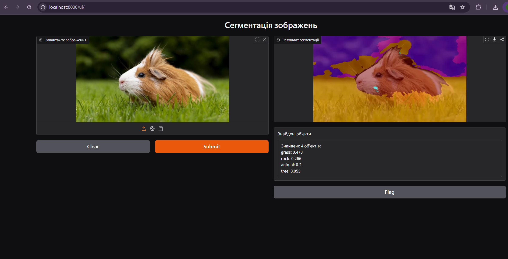

# Segmentation API

## Overview
REST API + Gradio веб-інтерфейс для семантичної сегментації зображень.
Модель визначає об'єкти на фотографії і повертає список знайдених класів
з часткою площі кожного.

## Deployment info
- FastAPI — REST API для програмного доступу
- Gradio UI — веб-інтерфейс для ручного тестування в браузері
- Запускається одною командою через Uvicorn (ASGI сервер)

## Installation

1. Клонувати репозиторій
2. Створити віртуальне середовище:
   python -m venv venv
   source venv/bin/activate  # Windows: venv\Scripts\activate
3. Встановити залежності:
   pip install -r requirements.txt
4. Запустити сервер:
   uvicorn main:app --reload

## Modeling info
- Модель: nvidia/segformer-b0-finetuned-ade-512-512 (HuggingFace)
- Архітектура: SegFormer — трансформер для семантичної сегментації
- Датасет: ADE20K (150 класів: небо, дорога, машина, дерево тощо)
- Фреймворк: HuggingFace transformers

## Interface description

### GET /
Перевірка що сервер працює.
- Вхід: немає
- Вихід: {"status": "ok"}

### POST /predict
Сегментація зображення через REST API.
- Вхід: зображення (multipart/form-data, поле "file")
- Вихід: {"segments": [{"label": str, "score": float}], "total": int}
- score — частка площі зображення яку займає клас (0.0 — 1.0)

### GET /ui
Gradio веб-інтерфейс для ручного тестування.
- Вхід: зображення через браузер
- Вихід: зображення з кольоровими масками + список знайдених об'єктів

### GET /docs
Автоматична документація FastAPI (Swagger UI).
- Дозволяє тестувати всі ендпоінти прямо в браузері

## Example
